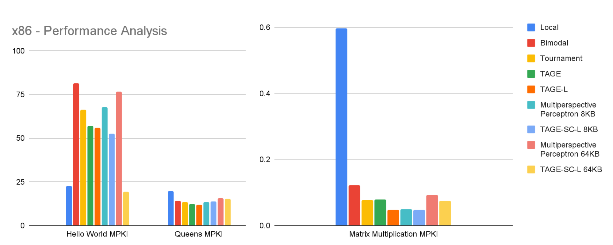
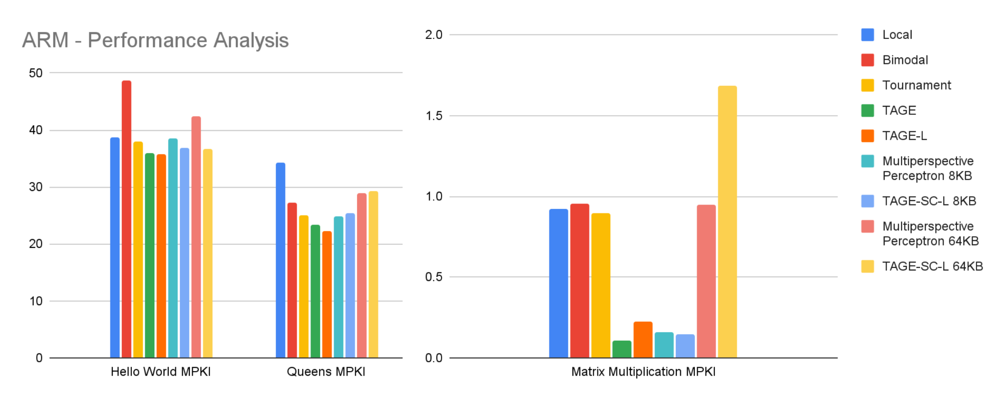
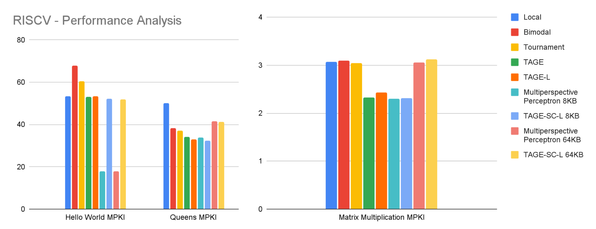
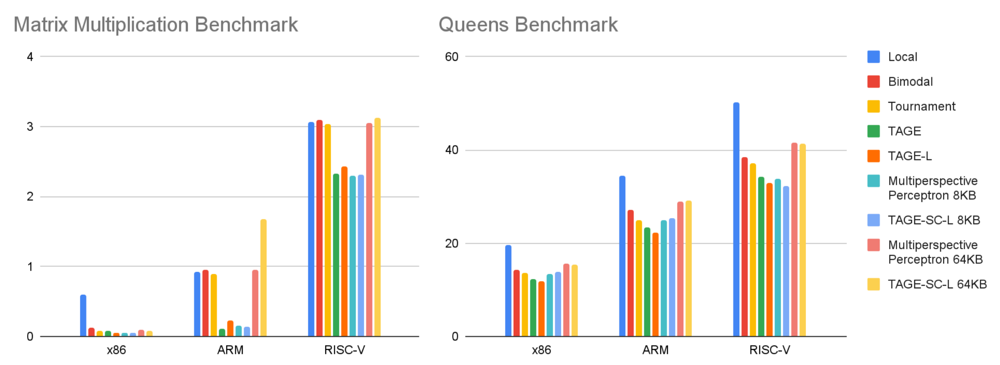

# Final Report: Branch Prediction Simulation Using gem5

1. [Proposal](proposal.html)
2. [Mid-term progress report](progress.html)
3. **Final report**

[GitHub Repo](https://github.com/gabrielkulp/branch-predictors)

CS/ECE 570. March 15, 2022.  
Adit Agarwal, Gabriel Kulp, Vaibhavi Kavathekar, Vlad Vesely.


## Summary
Branch prediction is an essential component of high-performance processor design. Different branch predictors are good in different situations, so choosing the right predictor for your workload is essential. We took on the project of researching various predictor algorithms, then working through the process of simulating them. Our goal was to provide a reference for future projects or classes and demonstrate the feasibility of microarchitectural simulations in a group coursework setting, rather than to design an original predictor or choose the best predictor for a certain workload. Therefore, we chose to simulate state-of-the-art predictors against classic simulators for the purpose of demonstrating branch prediction in gem5.

To select useful branch predictors to simulate, we examined recent processor implementations and theoretical papers from academia. We then chose the gem5 open-source full-system simulator to explore the build process and runtime options for simulating a variety of branch predictors across several benchmarks and several instruction set architectures.

## Background and Branch Predictor Selection

We divide predictors into three waves: Classic, "State of the Art", and Cutting Edge (see Fig. 1). Classic predictors were developed in the 1980s and 1990s. Most of these have been covered during the course of ECE570, and thus their analysis is left to the reader. Cutting edge predictors are new predictors, developed 2018-2022, that show high performance, but that have not yet been rigorously examined or have some flaws that prevent them from being implemented well. Our focus is on high performance predictors developed 2001-2018, which we term "state-of-the-art".

![Fig. 1: Our classifications of branch predictors. [3]](final-fig-1.png){#fig:label}

We looked at two different pieces of evidence for determining which predictors to consider state-of-the-art.

First we examined use by recent processor designs. Although Intel and Apple are very sensitive about details of their branch predictors, several other major companies have released academic papers or whitepapers detailing predictor architectures their recent flagship processors utilize. Perceptron predictors are used in AMD Zen, AMD Zen 2 cores (released 2017 and 2019), and Samsung Exynos processors (2011-2019) [5,1]. The only known use of a TAGE predictor is in the AMD Zen 2 core [5]. Based on this track record, TAGE and Perceptron predictors can be clearly categorized as both practical and high performance.

Second we examined results from Championship Branch Prediction competition. CPB is a session that is occasionally attached to International Symposium of Computer Architecture (ISCA) conferences. Despite less adoption by industry, TAGE predictors have won every Championship Branch Prediction (CPB) competition since the family was introduced. TAGE predictors currently have the highest potential for branch predictor improvement in future years, contingent on improvements in practical elements, to be addressed later.

Multiple versions of both the TAGE and the Perceptron branch predictors were included in gem5, allowing them to be simulated without the creation of custom models.

### TAGE Branch Predictor

The first TAgged GEometric history branch predictor (TAGE) was introduced in 2006 [6]. TAGE predictors use a base predictor with multiple partially tagged branch histories that modify the base prediction. The history of each branch is of a different length in order to capture system behavior better without collisions. Structurally, TAGE is a combination of the GEHL and PPM-like predictors [3,4]. The PPM-like predictor was the first multi-order approximation of the Prediction by Partial Matching (PPM) text compression algorithm. This algorithm was first used in branch predictors in 1998 by the YAGS predictor [2]. By combining the geometric history length of the GEHL predictor with the multiple PPM approximation of PPM-like, the TAGE family can achieve very long history lengths.

![Fig. 2: TAGE Branch Predictor [8]](final-fig-2.png){#fig:label}

**Table Sizes:** The basic structure is shown in Fig 2. Here we note that the storage size increases with the T number. Here we could use the following geometric history algorithm:
$$L(i) = (int)(ai-1*L(1) + 0.5)$$
If $L(1) = 2$, and $a = 2$, then the following table of history lengths would result. Note that these coefficients could be changed. TAGE predictors have been evaluated with up to 30 tables [10]. Addition of more tables benefits the prediction by allowing evaluation of longer correlations or smaller increments between history lengths, but after a certain point are not practical. This will be addressed later.

| Table # | T0 | T1 | T2 | T3 | T4 |
|---------|----|----|----|----|----|
|History Entry Count|0|2|4|8|16|

**Prediction:** The prediction contained in each table is stored as a counter. If negative, the value is "Not Taken" (NT). If positive, the prediction is "Taken" (T).

**Tags:** Tags are checked against the program counter. When a match occurs, the corresponding prediction is passed to the muxed path.

**Selection:** When one or more tables assert a tag match, the one with the longest history (highest T#) takes precedence. This is implemented very simply by the set of muxes shown in the bottom of Fig 2. This function is a "meta-predictor": a predictor that predicts which predictor will be most accurate.

**Base Predictor:** If no tag matches the program counter, the base counter's prediction is used. This is typically implemented as a bimodal predictor.

**Useful Counter:** The useful counter keeps track of how useful a particular prediction entry is, and provides the decision on how to. When a prediction is selected as the output prediction, the count is increased. Note that this is different than a tag match. Rather, it is whether this prediction was the dominant prediction that actually propagated to the output. This allows the predictor to figure out which tag entry to throw out and re-allocate to a new PC address. By being able to find the oldest tags the predictor can more safely replace branches that are not likely to be called again. This is the basic thrust of the useful counter. Multiple adaptions to the useful counter have been adopted. This is one of the more active areas of discussion in TAGE predictors.

#### Advanced TAGE Features and Improvements
The most widely adopted improvements to this architecture are the Statistical Corrector (SC) secondary predictor, and the Loop Predictor (LP), as shown in Fig. 3. These fortify the original TAGE predictions for specific circumstances that prove troublesome. Later TAGE predictors also improve the useful counter update policy.

![Fig. 3: Structure of a TAGE-SC-L Branch Predictor [7]](final-fig-3.png){#fig:label}

Loop predictors attempt to identify fixed-length loops. Essentially this checks to see if a loop has exited after the same number of iterations multiple times. If a loop executes N times for several calls, then when the loop comes up in the future, it is signaled as a loop with length N. The Nth iteration is then predicted to be a loop exit, and the loop predictor overrides the TAGE predictor [8]. This can be very helpful for situations such as inner loops.

Weakly correlated branches and the necessity of statistical correlators were not explained well by Seznec in his TAGE papers. Michelund examines the root issue [11]. Essentially the TAGE family has a difficult time predicting branches that do not bias strongly in one direction. If a branch only goes in one direction 40% of the time (0.4), then it takes more iternations for the predictor to properly predict it than a branch that has the same result 90% of the time. A statistical corrector detects these branches that are not well correlated with their local history, and proceeds to invert the TAGE output when it fails to predict these branches correctly [9]. The SC is placed after the TAGE as shown in Fig. 2. These features were coupled with the base TAGE predictor in 2014 to form the TAGE-SC-L [7].

As mentioned in the predictor survey, the TAGE predictor has won every CPB. Why then do many companies ignore TAGE in favor of Perceptron? While CPB results are useful, the submissions are only limited by the memory size allocated for predictors. Latency is not included. In fact, most TAGE papers do not discuss latency at all. However, we conjecture that there is an approximately linear increase in delay with the addition of each table, due to the addition of additional multiplexers in the critical path flowing from the base predictor to output. Such a trend is unfortunate since accuracy in general increases with the number of tables. For example, to achieve maximum performance at CBP 2016, the proposed TAGE-SC-L used 30 history tables.

The lack of attention to latency may be a reason that TAGE predictors are not used very often at high performance levels. One solution is to use it in parallel with a lower latency predictor. AMD places their TAGE-SC-L in conjunction with a lower latency Perceptron predictor [5]. This is one region where active research may yield results for industry.

### Concept of Perceptron

{#fig:label}

The perceptron is an early form of neural network invented in 1962 [12]. Perceptrons can classify inputs based on a linear function. They fit in the supervised learning category of machine learning. It accepts some inputs $x$ and contains $w$ weights and bias.

The bias is an added adjustable term to the sum of inputs and weights that allows the shift of the activation function for increased model accuracy. The result is calculated by multiplying the inputs with their corresponding weights, summing these products, and then passing through an activation function.

This operation can be understood by a simple equation:
$$y = w_0 + \sum_i{n(x_i\cdot w_i}$$
Where $n$ is the activation function and $i$ indexes the weights and activations.

### Perceptron Branch Predictor

![Fig. 5: Structure of a perceptron branch predictor [13]](final-fig-5.png){#fig:label}

The decision-making of the perceptron branch predictor, shown in Fig. 5, is easy to understand. The predictor assigns each bit of the history register a corresponding weight and if a bit is correlated more than the other bits, the magnitude of that particular weight is higher. Thus, the perceptron learns correlations between bits in the branch history register. These weights are summed together as shown above. The outcome is a number, i.e. 1 or -1, that corresponds to T or NT.

The main advantage of using a perceptron neural network in branch prediction is its use of long history lengths as it only requires space linear in history length, as opposed to other predictors such as Gshare which require space exponential in the history length. The 2001 perceptron was the first branch predictor to be capable of using global branch history tables with more than 60 entries [11].

#### Perceptron Branch Predictor Operation
- Initially the branch address is hashed in order to produce an index.
- This index is used to fetch a particular perceptron into a vector register of weights $w$.
- One of the integral components of the perceptron Branch Predictor is its Branch History register which maintains a record of all the oldest and the most recent branches.
- After the perceptron is fetched into the vector register, the dot product is performed between the Branch History register and the weights.
- As stated above, the computation of perceptron output is easy and is determined on the value of $y$ which is an integer. If the value of $y$ is 1, the branch is predicted to be taken and if the value of $y$ is -1, the branch is predicted to be not taken. 
- Finally, after the actual outcome of the branch is known, the training algorithm uses the actual outcome and the value of $y$ in order to update the weights in the perceptron table.
- Perceptron neural network relies just on pattern history (branch taken or not taken) which makes it suitable for just linearly separable branches.

### Advancements in Perceptron Branch Predictors
There has been evolution in Perceptron Branch Predictors over the years. One of the common factors of improvement in most of the proposed perceptron/neural network predictors is the weight selection approach. 

**Fast Path Based Neural Predictor:** The operation of the predictor can be easily interpreted by the graph in Fig. 6, where the predictor predicts a branch by selecting a neuron along the path to that particular branch in order to make a prediction, rather than selecting all the neurons simultaneously based on the available branch address. This approach increases the accuracy and decreased the latency of the predictor. Prior to this approach, the original perceptron had a latency of 4 cycles, which rendered it impractical. This reduces the latency to around 1 cycle. The predictor uses the path and the pattern history together which is useful to predict linearly and non-linearly separable branches. [14]

![Fig. 6: Principal Innovation of the Fast Path Perceptron [14]](final-fig-6.png){#fig:label}

**Global/Local Hashed Perceptron:** The predictor combines the local and the global history as shown in Fig. 7 to index the weights of the perceptron as opposed to the previous versions of the perceptron branch predictors which use just the local history or global history for the weight selection process. Some weights are selected by XORing the local branch history with the branch address and some are selected by XORing the global branch history with the branch history, thereby lowering the misprediction rate and increasing the accuracy over the fast path based neural predictor [15].

![Fig. 7: Novel Addressing of Global/Local Hashed Perceptron [15]](final-fig-7.png){#fig:label}

### Cutting-Edge Predictors

Most of the neural branch prediction schemes using advanced machine learning algorithms and multilayer neural networks are based on the original perceptron model. The original perceptron branch predictor is only able to classify linearly separable branches, so these more advanced networks add more layers and different structures to recognize more complicated functions.

Some of the most recent advanced neural predictors include:

**Sliced Recurrent Neural Networks (2020):**

![Fig. 8: Sliced Recurrent Neural Network [16]](final-fig-8.png){#fig:label}

This particular branch predictor uses the concept of the Sliced Recurrent Neural Network algorithm in order to make the branch predictions. The principal of SRNN is based on the operation of RNN(Recurrent Neural Network). The distinguishing factor of the RNN’s from the other neural networks is memory [16]. 

The RNN network structure, shown in Fig. 8, operates in a way that the subsequent nodes remember the information and this information is then passed to the corresponding nodes and eventually to the output. 

The SRNN uses the input subsequence of RNN, divides the sequence, runs RNN on each subsequence and merges the output of each subsequence as a new input sequence in order to compute the output.

**DNN Based Models:**
Deep Neural Networks are a set of algorithms in order to train multilayer neural networks. These algorithms, when used in Branch predictors, have the same input and output structure as that of the perceptron branch predictor, although the middle part comprises the RBM’s (Restricted Boltzmann’s machine) and several hidden layers for its operation. This predictor's performance was nearly the same as that of the 2016 CBP winner, showing that this advanced approach has promise regarding cutting-edge performance [17].

![Fig. 9: Deep neural network [17]](final-fig-9.png){#fig:label}

These more advanced neural network branch predictors require offline training (training on datasets before operation). This limits their applicability to general processing applications, where program flows are diverse. Current predictors are all able to operate without prior training, and thus have a great advantage. It remains to be seen if effective initialization policies will be invented to deal with the training requirement. Since clever initialization schemes have already been used to improve TAGE predictors across time (indeed, one of the main improvements of the TAGE over the PPM-like predictor was its useful counter initialization policy [6]), it may be possible for designers to make these more complicated neural networks viable for use in real systems.

## Simulation

While it's possible to evaluate different branch predictors by hand, this quickly becomes unreasonable as the simulated workload increases. Since representative workloads will necessarily be large, the best option is instead to simulate the processor's microarchitecture. Then, you can assume that any statistics you collect during that simulation apply to a physical processor running your target workload.

In this section, we discuss our simulator of choice, how we conducted simulations of TAGE, Perceptron, and a selection of basic predictors, and the results.

### What is gem5?
gem5 (yes, without capitalization) is like a virtual machine, but instead of just tracking architectural state as it executes instructions, it also tracks microarchitectural state, including caches, branch prediction, functional units, and it can simulate peripherals like GPUs and network cards. Additionally, this full-system simulation is fully instrumented, meaning that we can collect statistics about any aspects of operation. gem5 also has many features we aren't interested in for this report, including simulating heat and energy consumption.

To simulate a system, gem5 needs to know what to simulate. Systems are made of swappable modules, allowing you to define whatever you need, and write new modules if you need something new. gem5 already has modules for each of the branch predictors we chose to simulate (we actually learned this after choosing them), so we won't need to dive into modifying the gem5 source code to add additional modules.

Out of the box, gem5 supports several CPU models (Minor, AtomicSimple, and TimingSimple to name a few), but for this project, we chose to use the O3CPU model, since it's the only one that includes a branch predictor. The O3CPU model is modern (2020), based on the Alpha 21264 CPU, and ISA-independent.

O3 stands for Out of Order. This model has the following pipeline stages:

1. **Fetch:** In addition to fetching instructions from the instruction cache, this stage also implements branch prediction and based on the prediction, determines the next fetch. In gem5, the `fetchWidth` determines the number of fetches per cycle.
2. **Decode:** This stage is responsible for preprocessing the instructions and handling unconditional branches. The number of instructions to be processed per cycle is controlled through the `decodeWidth` parameter. 
3. **Rename:** Values in the reorder buffer are allocated as per instructions. This can be controlled by the `renameWidth` parameter.
4. **Issue/Execute/Writeback:** These stages are handled in the same cycle. Available operands are passed to functional units, controlled by `dispatchWidth`. Instructions are then processed at the functional units. Conditional branch mispredictions are also recognized here. Results are then sent back to physical registers, controlled by the `wbWidth` parameter.
5. **Commit:** Processes and empties the reorder buffer. The number of operations (or micro-operations in the CISC case) are controlled through the `commitWidth` parameter.

Each stage is capable of squashing instructions in the event of branch misprediction, and since it's ISA-independent, we can run our branch prediction tests on x86, ARM, and RISC-V. Interestingly, even though the O3CPU is based on a real Alpha chip, gem5 generally doesn't support Alpha build very well anymore.

### Branch Prediction in gem5
Having learned about O3CPU, let’s see how branch predictors are implemented in gem5. All the types of predictors are declared in the `BPredUnit` SimObject (module), which is also responsible for invoking the correct one depending on the simulation configuration.

The `BPredUnit` class acts as a wrapper class and thus, it contains specification for the branch predictor and BTB. It contains several functions, some familiar functions are:
- `predict`: Predicts whether any branch is taken or not
- `lookup`: Checks if the jump at the current program counter is taken or not
- `btbUpdate`: Checks for branch taken or not due to missing/invalid BTB address and updates relevant counter in local and global predictor
- `BTBValid`: Checks if entries in BTB and program are matching or not.
- `update`: Updates branch predictor regarding prediction 

Default sizes are declared in `BranchPredictor.py`: there are 4096 BTB entries, and each has a 16-bit tag. The local branch predictor has a 2048-entry local history table with 2 bits per counter, the tournament predictor uses the same size for its local history table, the `BiModeBP` model uses an 8192-bit global predictor size, and the TAGE and LTAGE models use the same. TAGE_SC_L additionally defines 2MB of default loop entries. Therefore, some branch predictor models do not require the predictor size to be implemented at the time of execution, but that would also depend on configuration scripts and parameters passed in it.

### Building and Running gem5

#### Building
The gem5 repository is surprisingly complicated to work with. With almost two million lines of code, a build process that takes 20-40 minutes, and a 700MB executable at the end, it should be avoided when possible. Additionally, there's plenty of documentation, but it did not cover our use-cases, and was generally difficult to navigate. Finally, in this situation, one might resort to a guide, slides or assignments from other universities, or some other introductory walkthrough material; we could not find much content like this, and none that was up-to-date and usable.

This complication led to an isolationist approach: take the complication of the build process, and hide it behind an abstraction that every group member can interact with instead. We chose to use Docker to provide this consistent and isolated platform, since it's a standardized open-source tool with good documentation, cross-platform support, and distribution mechanisms built in to share build results easily.

Docker is a container management platform that offers an isolated container with its own filesystem, networking, inter-process communication, and more. Containers are built using a Dockerfile, which uses a special scripting language to describe how files should be moved around and what commands to run inside the container. In our case, we started with a Debian container, installed essential build tools, the gem5 dependencies, and `git`, then cloned and built from source. The final product is a container that has all the required tools to build again, but it also has the final `gem5` executable along with all of its runtime dependencies. This final image is then stripped of nonessential packages, the source code, and intermediate build files to produce a minimal image for running `gem5`.

This approach has many advantages: first, only one group member has to perform the build process, since the result would be identical for anyone performing the build. Second, the final slimmed-down image can be uploaded and shared so that anyone (from the group, or a classroom, or a production server) can run the same software while guaranteeing that if "it works on my machine" then it will work elsewhere, too. Finally, every step can be automated, and triggered by making a commit to a GitHub repository, sending a message to a chatbot, or running a simple script yourself.

Finally, we can automate building different "flavors" of gem5 images, depending on the ISA we want to simulate (a single `gem5` executable can only simulate a single ISA). Since it just takes some different arguments during the build process to change the target architecture, it's nearly trivial to triplicate the build process automation. Similarly, we need to build our benchmark programs (more on these in the Workloads section below) for each architecture, and that's easily scripted once someone figures out the procedure for the first build.

#### Running
The process of running gem5 can be automated in a very similar way to building it. Running takes two file inputs: a configuration script, and a workload program. It also creates and populates the `m5out` folder with whatever statistics you decided to collect (as defined by the configuration script).

Configuration scripts specify system specification for gem5 to execute. A simple system can be implemented with just one CPU core and one DDR3 memory channel connected to the same bus. The configuration script uses the m5 library to instantiate Simulation Objects (`SimObject`) which contains functional information (not timing level like physical memory ranges, voltage domain, etc.). Our setup used the following `SimObject`s:

- Clock (1 GHz for simplicity)
- Memory Range (Address) (512MB for simplicity)
- CPU type - Timing Simple/O3CPU
- `SystemWide` memory BUS
- Cache Ports
- Memory Controller (DDR3)

### Procedure
The following is a representative command to run a single test on one workload:

```
$ gem5 configs/example/se.py --cpu-type=O3CPU --caches --l2cache
  --bp-type=LocalBP --cmd benchmarks/queens.riscv --options 16
```

The command-line options have the following meanings:
- `se.py`: Default configuration script, included in the repo
- `cpu-type`: O3CPU has a branch predictor
- `caches`: Memory hierarchy configuration
- `bp-type`: Branch predictor type
- `cmd`: Workload command
- `options`: Workload command-line options

Based on the configuration script se.py, following branch predictor models were available for analysis. BiMode, LTAGE, LocalBP, MultiperspectivePerceptron64KB, MultiperspectivePerceptron8KB, MultiperspectivePerceptronTAGE8KB, MultiperspectivePerceptronTAGE64KB, TAGE, TAGE_SC_L_64KB, TAGE_SC_L_8KB and TournamentBP.


### Workloads
We used three workloads for testing: Hello World, N-Queens, and Matrix Multiplication. This is by no means a comprehensive benchmark, but it illustrates that we are able to 

**Hello World** just prints its name and exits. It's not great for this evaluation, but we can use it to talk about short workloads that don't have time to warm up the predictor.

**N-Queens** is a classic algorithms problem and it has lots of conditional and early-termination loops that really stress a predictor. A N-Queens program is trying to place N number of queens in a NxN chessboard so that no two queens attack each other. Typically, it would have a huge number of possibilities( for example if N =10, the number of possible combinations would be 100!-90!, a very large number).

**Matrix Multiplication** is the classic example of a best-case scenario for loop predictors since it's so consistent. We're multiplying two 84x84 matrices, blocked into 2x2 registers.

## Results

Our full results, including in tabular form, can be viewed on [this spreadsheet](https://docs.google.com/spreadsheets/d/1mfXuLZ33ts2DveEJJsTd9mivvhYPveIV_depDIlRNxQ/edit?usp=sharing). We will summarize our findings in this section.

Results are measured in MKPI: misses per kilo-instruction. This is the standard measure of a system's performance with respect to branch prediction. This measure on its own should indicate that comparisons between ISAs are invalid because of differences in verbosity (x86 instructions do more, so expect there to be fewer of them, despite the same branching control structures as, say, RISC-V).

The workloads are also optimized for x86: we actually had to modify the source of the Matrix Multiplication benchmark to remove some inline x86 assembly. This will obviously give that ISA an advantage. Comparisons only make sense between different branch predictors while all else is held constant.

MPKI also varies so wildly across ISAs and workloads that **we needed to use a different vertical scale for nearly every plot**, even though **the units are the same**. Matrix Multiplication on x86 has an MPKI below 1 (and below 0.1 for some predictors), while Queens on RISC-V was around 30-40 MPKI across the predictors. This variation is expected.

Finally, the Hello World benchmark results are not particularly "useful". They're helpful in verifying that statistics are collected and reasonable, but nobody is making microarchitectural design decisions based on the performance of Hello World. This is because, with such a short runtime, the predictors don't have time to "warm up" to the situation and learn likely branching outcomes.

**In short, almost all the useful information in these plots comes from the relative heights of neighboring bars.** Now, with all that out of the way, here are some plots (again, there are more data at the link above):

{#fig:label}

{#fig:label}

{#fig:label}

{#fig:label}


## Discussion
Regarding size, we may contrast our approach to that of the Championship Branch Prediction. CPB evaluates branch predictors over 20 traces of ~30 million instructions each [6]. According to Seznec and Michaud, these traces are considered short! Cumulatively these programs total approximately $6 * 10^9$ instructions. Our largest benchmark was matrix multiplication on RISC-V, which for a 84x84 multiplication was about $9.5 * 10^5$ instructions. Program size was limited by the speed of our personal computers. Without a server or serious upgrade we would not be able to perform comparable simulations to those used by the CPB. Unfortunately, we would need root access to use Docker, so without administrative approval we were not able to use OSU's high-performance servers for simulation.

Diversity of analysis is critical for analyzing a general purpose branch predictor. Programs have different statistical properties that lend themselves better to different varieties of branch predictors. To achieve a fair comparison, multiple domains must be simulated. The CBP ensures this by picking 20 different traces from 4 categories: multimedia, server, integer (specint), and floating-point (specfp). We limited our exploration to only three programs to avoid scope creep and keep the focus on our method rather than specific applications of that method. The various results for "best branch predictor" in each situation were slightly different. Thus, in architecture selection it is important to know the application.

Benchmarks come in standard suites for a reason. We can't really draw good conclusions about these predictor types with only our three benchmarks. We didn't get the impression that gem5 is the standard tool for branch prediction benchmarks; it seems to be more common to use it for trying different memory hierarchies.

## Citations

- [1] B. Grayson et al., "Evolution of the Samsung Exynos CPU Microarchitecture," 2020 ACM/IEEE 47th Annual International Symposium on Computer Architecture (ISCA), 2020, pp. 40-51, doi: 10.1109/ISCA45697.2020.00015.
- [2] A. N. Eden and T. Mudge, "The YAGS branch prediction scheme," Proceedings. 31st Annual ACM/IEEE International Symposium on Microarchitecture, 1998, pp. 69-77, doi: 10.1109/MICRO.1998.742770.
- [3] A. Seznec, "The O-GHEL Branch Predictor," presented at JILP - Championship Branch Prediction, December 2004, Portland, United States. https://jilp.org/cbp/Andre.pdf
- [4] P. Michaud, "A PPM-like, Tag-Based Predictor," presented at JILP - Championship Branch Prediction, December 2004, Portland, United States. https://jilp.org/cbp/Pierre.pdf 2004 
- [5] D. Suggs, M. Subramony and D. Bouvier, "The AMD “Zen 2” Processor," in IEEE Micro, vol. 40, no. 2, pp. 45-52, 1 March-April 2020, doi: 10.1109/MM.2020.2974217.
- [6] A. Seznec and P. Michaud "A Case for (Partially) TAgged GEometric History Length Branch Prediction" Journal of Instruction Level Parallelism, vol. 10, Feb 2006. https://jilp.org/vol8/v8paper1.pdf [Accessed Feb 15, 2022]
- [7] A. Seznec, "TAGE-SC-L Branch Predictors" presented at JILP - Championship Branch Prediction, Minneapolis, United States, June 2014, https://hal.inria.fr/hal-01086920
- [8] A. Seznec, "The L-TAGE branch predictor," in Journal of Instruction Level Parallelism, vol. 9, May 2007. https://jilp.org/vol9/v9paper6.pdf [Accessed Feb 8, 2022]
- [9] A. Seznec, "A New Case for the TAGE Branch Predictor," MICRO 2011 : The 44th Annual IEEE/ACM International Symposium on Microarchitecture, 2011, ACM-IEEE, Dec 2011, Porto Allegre, Brazil. hal-00639193
- [10] A. Seznec, "TAGE-SC-L Branch Predictors Again," presented at 5th JILP Workshop on Computer Architecture Competitions (JWAC-5): Championship Branch Prediction (CBP-5), Seoul, South Korea, June 2016. https://hal.inria.fr/hal-01354253/document
- [11] P. Michaud, "An Alternative TAGE-like Conditional Branch Predictor," ACM Trans. Archit. Code Optim, 2018, vol. 15, No. 3, Article 30, pp. 1-23, DOI:https://doi.org/10.1145/3226098
- [12] D. A. Jimenez and C. Lin, “Dynamic branch prediction with perceptrons,” Proceedings HPCA Seventh International Symposium on High-Performance Computer Architecture, 2001, pp. 197-206, doi: 10.1109/HPCA.2001.903263.
- [13] D. Schor. "A Look At The AMD Zen 2 Core." wikichips.com https://fuse.wikichip.org/news/2458/a-look-at-the-amd-zen-2-core/ [Accessed March 6, 2022]
- [14] D. A. Jimenez, “Fast path-based neural branch prediction,” Proceedings. 36th Annual IEEE/ACM International Symposium on Microarchitecture, 2003. MICRO-36., 2003, pp. 243-252, doi: 10.1109/MICRO.2003.1253199.
- [15] A. S. Fong and C. Y. Ho, “Global/Local Hashed Perceptron Branch Prediction,” Fifth International Conference on Information Technology: New Generations (itng 2008), 2008, pp. 247-252, doi: 10.1109/ITNG.2008.258.
- [16] L. Zhang, N. Wu, F. Ge, F. Zhou and M. R. Yahya, "A Dynamic Branch Predictor Based on Parallel Structure of SRNN," in IEEE Access, vol. 8, pp. 86230-86237, 2020, doi: 10.1109/ACCESS.2020.2992643.
- [17] Y. Mao, H. Zhou, X. Gui and J. Shen, "Exploring Convolution Neural Network for Branch Prediction," in IEEE Access, vol. 8, pp. 152008-152016, 2020, doi: 10.1109/ACCESS.2020.3017196.
